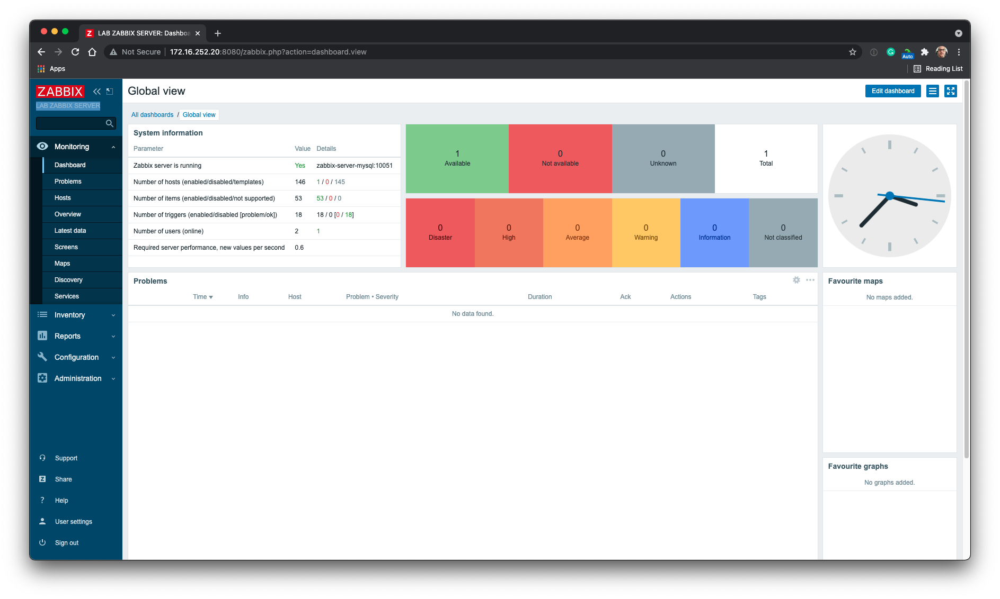
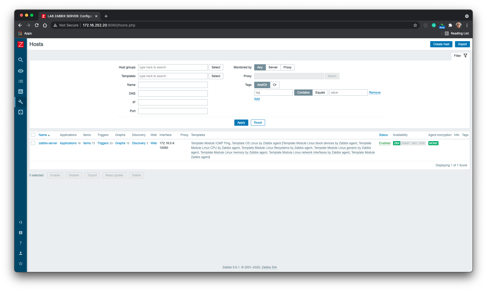
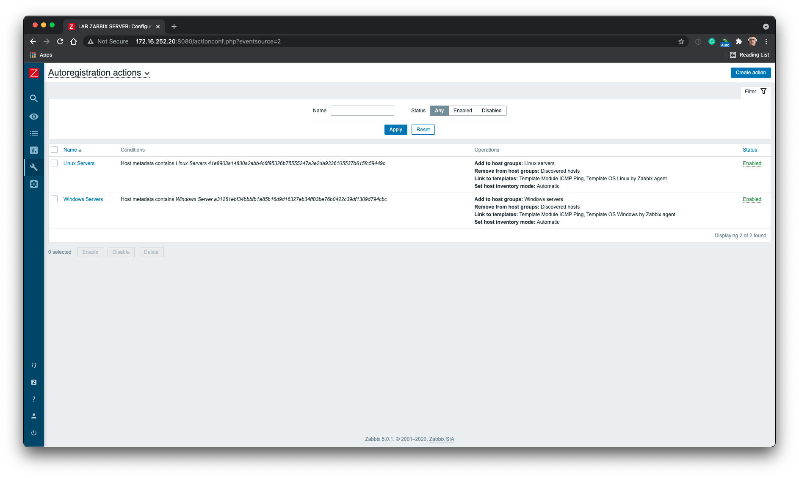
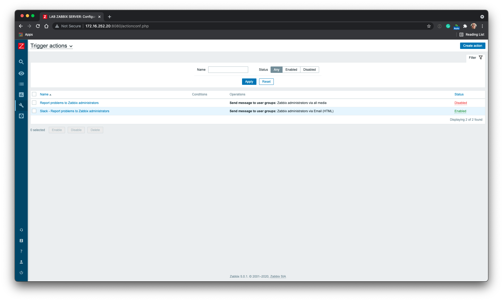
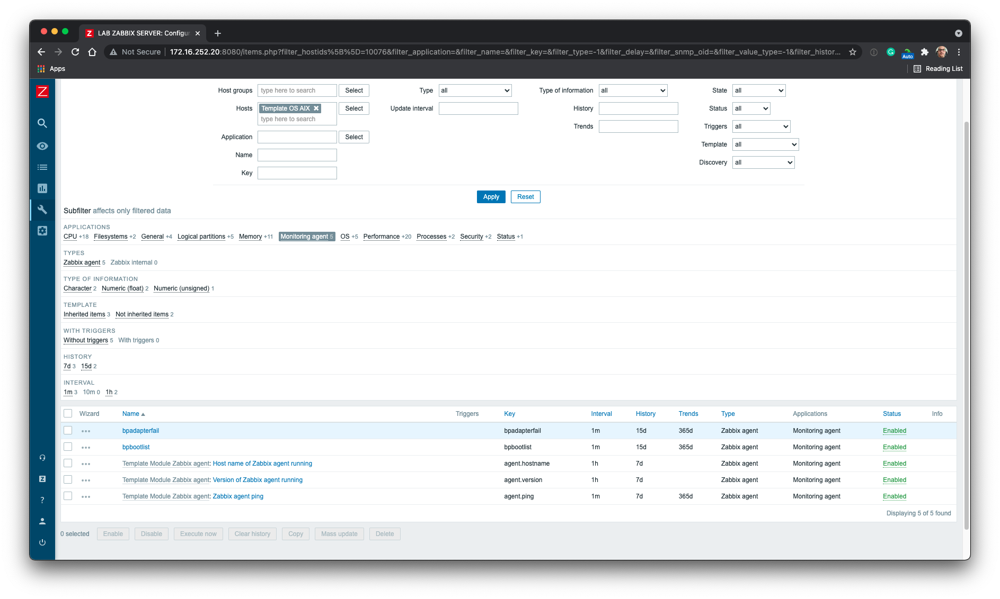
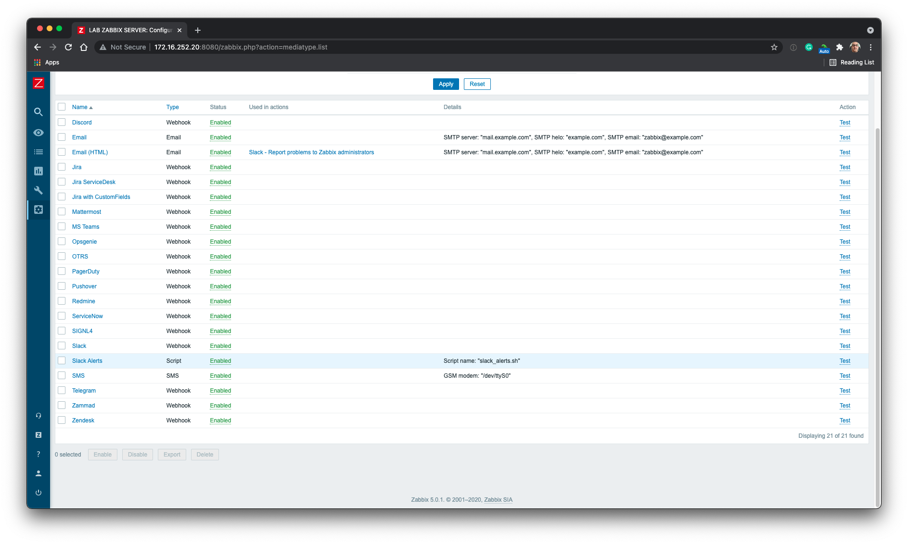

# **Install and Configure System Monitoring with Zabbix on Docker Container**

## **Requirements**

* Server  
  * Redhat Operation System Family
  * SSH Access
  * Docker 19.03+
  * ansible 2.9.21+

<details>
  <summary><b>Zabbix Server</b> <em>(Details)</em></summary>

Create new inventory:

```shell
cd inventories
cp sample <NEW INVENTORY>
```

#### **Inventory File**

Edit the file **hosts.yml** on **\<NEW INVENTORY>**

```yaml
---
all:
  vars:
    zabbix_web_server_name: "LAB ZABBIX SERVER" # Name of the Zabbix web server
    zabbix_server_ip:                           # IP of the Zabbix server
    zabbix_agent_port:                          # Port of the Zabbix agent
    mysql_zbx_db_pwd: ""                        # Password of the Zabbix database
    mysql_root_pwd: ""                          # Password of the root user of the MySQL server
  hosts:
    zabbix-server:
      ansible_host:                             # IP of the Zabbix server
  children:
    server:
      hosts:                                    # List of hosts for the Zabbix server
        zabbix-server:
    agent_linux:                                # List of hosts for the Zabbix agent on Linux
      hosts:
    agent_windows:                              # List of hosts for the Zabbix agent on Windows
      hosts:
```

#### **Test the Inventory File**

```shell
ansible -i inventories/lab/hosts.yml zabbix-server -u root -k -m ping
SSH password: 

zabbix-server | SUCCESS => {
    "ansible_facts": {
        "discovered_interpreter_python": "/usr/bin/python"
    },
    "changed": false,
    "ping": "pong"
}
```

#### **Install Zabbix Server**

```shell
ansible-playbook -i inventories/lab/hosts.yml -u root -k zabbix-server.yml
```

#### **idempotent**

This playbook will not be executed again if the log files already exist.

The logs file are:

* **/tmp/aix_check.log**
* **/tmp/hostid_check.log**
* **/tmp/ssl_check.log**
* **/tmp/zabbix_custom.log**
* **/tmp/zbx_hostgroup.out**

#### **Roles**

#### **common**

* [x] Ajustando o Hostname
* [x] Atualizando /etc/hosts
* [x] Habilitando IP Forward
* [x] Atulizando o Sistema
* [x] Instalando pacotes essenciais
* [x] Modulo Pip
* [x] Verificando pre requisitos
* [x] Verificando se o repositorio Docker existe
* [x] Habilitando o repositorio do Docker
* [x] Instalando o Docker
* [x] Habilitando o Servico do Docker

#### **mysql**

* [x] Verificando se o container existe
* [x] Download da imagem
* [x] Criando Network
* [x] Criando volume
* [x] Iniciando o Container

#### **server**

* [x] Verificando se o container existe
* [x] Download da imagem
* [x] Criando volume
* [x] Iniciando o Container (server)
* [x] Zabbix Agent
* [x] Iniciando o Container (agent)

#### **web**

* [x] Verificando se o container existe (web)
* [x] Download da imagem (web)
* [x] Criando volume (web)
* [x] Iniciando o Container (web)

#### **grafana**

* [x] Verificando se o container existe (grafana)
* [x] Download da imagem (grafana)
* [x] Iniciando o Container (grafana)

#### **custom**

* [x] Aguardando o Zabbix Web
* [x] Zabbix Custom - Verificando as customizações do Zabbix
* [x] Token - Copiando o script para gerar o token
* [x] Token - Gerando um token de autenticação
* [x] Token - Removendo Scripts Temporários de Customização
* [x] HostID - Copiando o script para gerar o hostid
* [x] HostID - Gerando um token de autenticação
* [x] HostID - Removendo Scripts Temporários de Customização
* [x] Slack Alerts - Disponibilizando Scripts
* [x] Slack Alerts - Copiando o script para o zabbix server
* [x] Slack Alerts - Criando Media para Alerta
* [x] Slack Alerts - Removendo Scripts Temporários
* [x] Resultado da criação do Slack Alert
* [x] Slack Alerts - Configurando log
* [x] Slack Alerts - Gerando log
* [x] Auto Registro Linux - Copiando o script para gerar o auto regitro
* [x] Auto Registro Linux - Criando Auto Registro de Servidores Linux
* [x] Auto Registro Linux - Resultado da criação do Auto Registro de Servidores Linux
* [x] Auto Registro Linux - Removendo Scripts Temporários
* [x] Auto Registro Windows - Copiando o script para gerar o auto regitro
* [x] Auto Registro Windows - Criando Auto Registro de Servidores Windows
* [x] Resultado da criação do Auto Registro de Servidores Windows no Zabbix
* [x] Auto Registro Windows - Removendo Scripts Temporários de Customização
* [x] Reporte de Problemas - Copiando o script para gerar o reporte de problemas
* [x] Reporte de Problemas - Criando Slack Reporte de Problemas
* [x] Resultado da criação do Slack Report de Problema
* [x] Reporte de Problemas - Removendo Scripts Temporários
* [x] SSL Check - Disponibilizando Scripts
* [x] SSL Check - Copiando os scripts para o zabbix server
* [x] SSL Check - Removendo Scripts Temporários de Customização
* [x] SSL Check - Configurando log
* [x] SSL Check - Gerando log
* [x] Criação de Item - Copiando Script Adapterfail
* [x] Criação de Item - Criando o Item Adapterfail
* [x] Criação de Item - Resultado da criação do Adapterfail
* [x] Criação de Item - Configurando log
* [x] Criação de Item - Copiando Script Bootlist
* [x] Criação de Item - Resultado da criação do Bootlist
* [x] Criação de Item - Configurando log
* [x] Criação de Item - Gerando log
* [x] Criação de Item - Removendo Scripts Adapterfail
* [x] Criação de Item - Removendo Scripts Bootlist
* [x] HostID - Configurando log
* [x] Removendo Primeiro Registro Zabbix server - Copiando Script
* [x] Removendo Primeiro Registro Zabbix server - Deletando o Primeiro Registro "Zabbix server"
* [x] Removendo Primeiro Registro Zabbix server - Resultado da remoção
* [x] HostID - Removendo Scripts zbx_del_first_zbxsrv

## **Screenshots**








</details>

<details>
    <summary><b>Zabbix Agent</b> <em>(Details)</em></summary>
</details>
